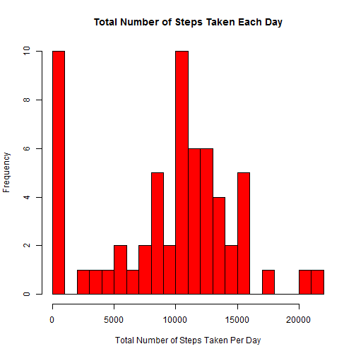
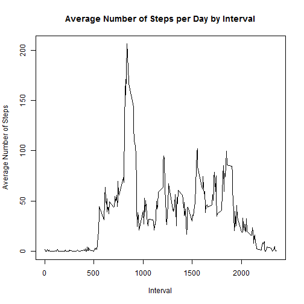
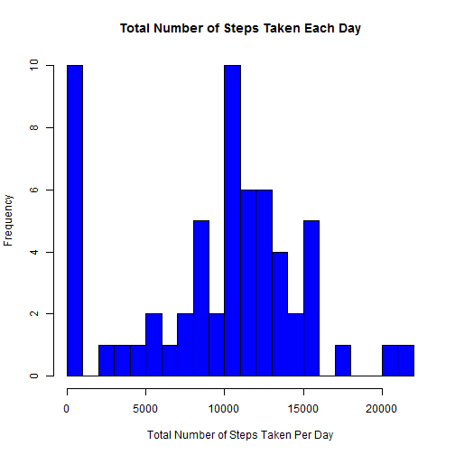
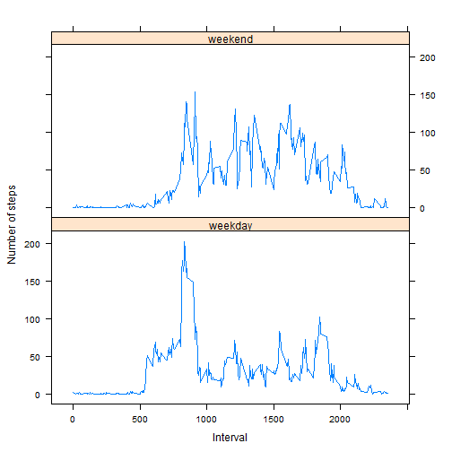

Reproducible Research - Peer Assessment 1
=========================================

## This is the R Markdown document for Peer Assessment 1 under 'Reproducible Research'.

### Loading and Preprocessing the Data


```r
activity <- read.csv("activity.csv", header = TRUE, na.strings="NA", stringsAsFactors = FALSE)
activity$date <- as.Date(activity$date, "%Y-%m-%d")
```

### Mean Total Number of Steps Taken per Day (ignore missing values)

1. Calculate total number of steps taken per day


```r
StepsTotal <- tapply(activity$steps, activity$date, sum, na.rm=TRUE)
```

2. Plot histogram of total number of steps taken per day


```r
hist(StepsTotal, breaks = 20, col = "red", main = "Total Number of Steps Taken Each Day", xlab = "Total Number of Steps Taken Per Day")
```

 

3. Calculate and report the mean and median of total number of steps taken per day


```r
meanStepsTotal <- mean(StepsTotal)
medianStepsTotal <- median(StepsTotal)
```

**The mean and median of the total number of steps taken each day are 9354.2295082 and 10395.**

### Average Daily Activity Pattern

1. Create a time series plot of the 5-minute interval and the average number of steps taken, averaged across all days


```r
AverageSteps_interval <- aggregate(steps ~ interval, activity, mean)
plot(AverageSteps_interval$interval, AverageSteps_interval$steps, type="l", xlab="Interval", ylab="Average Number of Steps", main="Average Number of Steps per Day by Interval")
```

 

2. Which 5-minute interval contains the maximum number of steps?


```r
AverageSteps_interval$interval[which.max(AverageSteps_interval$steps)]
```

```
## [1] 835
```

### Imputing Missing Values

1. Calculate total number of missing values in dataset


```r
NoMissing <- sum(!complete.cases(activity))
```

**Total number of rows with NAs is 2304**

2. Fill in all the missing values and create a new dataset with the missing data filled in


```r
library(Hmisc)
activityImputed <- activity
activityImputed$steps <- impute(activity$steps, FUN = mean)
```

3. Calculate total steps per day and plot a histogram


```r
StepsTotalImputed <- tapply(activityImputed$steps, activityImputed$date, sum, na.rm=TRUE)
hist(StepsTotalImputed, breaks = 20, col = "blue", main = "Total Number of Steps Taken Each Day", xlab = "Total Number of Steps Taken Per Day")
```

 

4. Calculate the mean and median of the total number of steps taken per day


```r
meanStepsTotalImputed <- mean(StepsTotalImputed)
medianStepsTotalImputed <- median(StepsTotalImputed)
```

**The mean and median of the total number of steps taken each day with the imputed data are 9354.2295082 and 1.0395 &times; 10<sup>4</sup>.**

**Imputing missing values results in no change in the mean and median.**

### Difference in Activity Patterns between Weekdays and Weekends

1. Create a new factor variable with two levels - weekday and weekend


```r
activityImputed$day <- weekdays(activityImputed$date)
activityImputed$day2[activityImputed$day == "Monday" | activityImputed$day == "Tuesday" | activityImputed$day == "Wednesday" | activityImputed$day == "Thursday" | activityImputed$day == "Friday"] <- "weekday"
activityImputed$day2[activityImputed$day == "Saturday" | activityImputed$day == "Sunday"] <- "weekend"
activityImputed$day2 <- as.factor(activityImputed$day2)
```

2. Make a panel plot containing a time series plot of the 5-minute interval and the average number of steps taken, averaged across all weekday days or weekend days


```r
AverageSteps_interval2 <- aggregate(steps ~ interval + day2, activityImputed, mean)
xyplot(steps ~ interval | day2, AverageSteps_interval2, layout = c(1, 2), type = "l", xlab = "Interval", ylab = "Number of steps")
```

 
